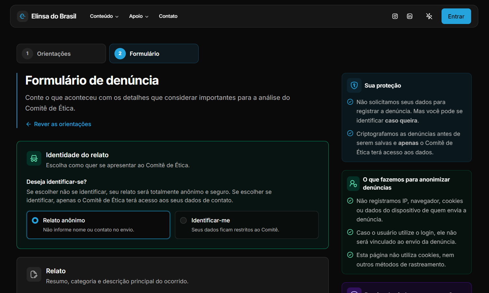
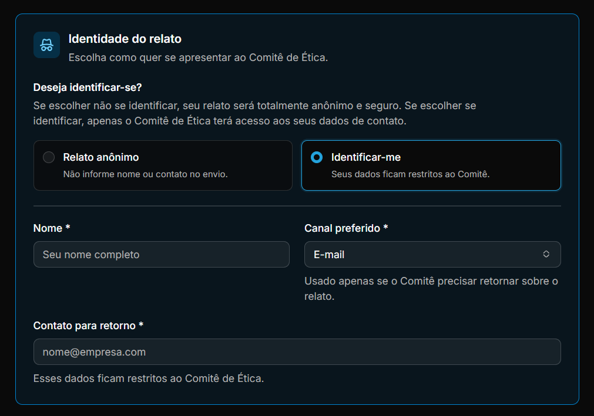
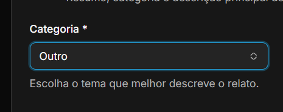
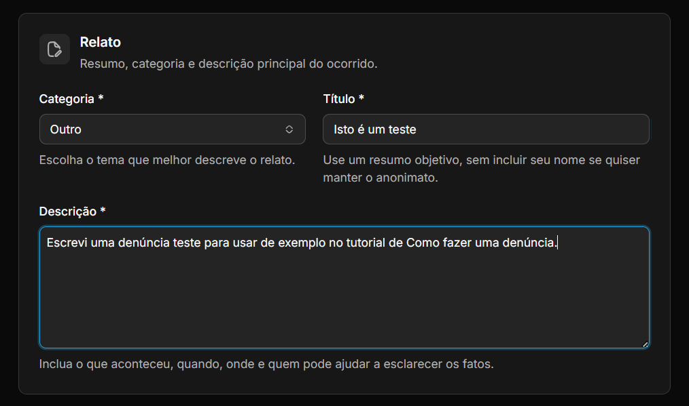
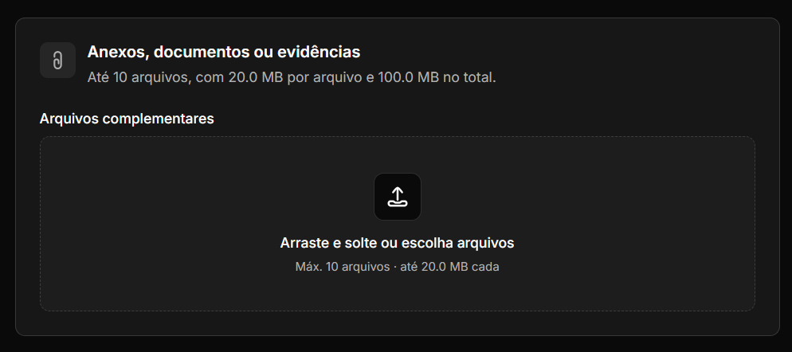

import { NotebookTabs, Flag } from "lucide-react";

Se você presenciou ou soube de uma situação que contraria os princípios da Elinsa, pode usar o Canal de Denúncias para registrar o que aconteceu. O relato será recebido e analisado pelo Comitê de Ética.

O canal está aberto a colaboradores e a pessoas externas à empresa. Você não precisa fazer login e pode escolher entre enviar um **relato anônimo** ou se identificar para receber um retorno do Comitê de Ética.

<Callout type="warn">
  Se houver **risco imediato à vida**, procure ajuda antes de preencher o formulário. Ligue para o SAMU (192), para o Corpo de Bombeiros (193) ou acione a supervisão de campo, se estiver em uma atividade da empresa.
</Callout>

---

## Passo a passo

### 1. Acesse o formulário

Você pode [acessar diretamente o formulário de denúncia](https://elinsadobrasil.com.br/denunciar/formulario).

Se você estiver na página de orientações do Canal de Denúncias, pode acessar o formulário de três maneiras:
- selecionando **Formulário** no topo;
- usando o botão **Ir para o formulário** no primeiro bloco da página;
- usando o botão **Ir para o formulário de denúncia** ao final das orientações.

### 2. Escolha entre relato anônimo e identificado

Você decide como prefere enviar a denúncia. O formulário começa com a pergunta **"Deseja identificar-se?"**, e o relato anônimo já vem selecionado.

Se preferir se identificar, você poderá informar um meio de contato para receber retorno do Comitê de Ética.

| Opção | O que acontece |
|---|---|
| **Relato anônimo** | O formulário não solicita seu nome nem um meio de contato. |
| **Identificar-me** | São exibidos os campos obrigatórios **Nome**, **Canal preferido** e **Contato para retorno**. O canal pode ser e-mail, telefone, WhatsApp ou outro. Esses dados ficam restritos ao Comitê de Ética. |

<Callout type="info">
  A escolha é sua. Se você preferir o anonimato, ainda poderá acompanhar o andamento da denúncia usando o protocolo recebido depois do envio.
</Callout>

### 3. Selecione a categoria

Escolha a categoria que mais se aproxima da situação. Não se preocupe se nenhuma opção parecer exata: a escolha serve como ponto de partida, e o Comitê de Ética poderá ajustá-la durante a análise.

| Categoria | Exemplos |
|---|---|
| Assédio moral | Humilhação, intimidação ou pressão abusiva no trabalho |
| Assédio sexual | Comentários, toques ou propostas de natureza sexual indesejados |
| Discriminação | Tratamento desigual por gênero, raça, orientação sexual, religião ou outra característica pessoal |
| Conflito de interesse | Decisões que beneficiam interesses pessoais em prejuízo da empresa |
| Fraude ou corrupção | Desvio de recursos, suborno ou falsificação de documentos |
| Descumprimento de normas | Violação de políticas internas, procedimentos ou regulamentações |
| Conduta indevida | Comportamento inadequado que não se encaixa nas categorias anteriores |
| Riscos à segurança | Condições inseguras de trabalho ou negligência com medidas de proteção |
| Meio ambiente | Descarte irregular, contaminação ou outros danos ambientais |
| Outro | Situação que não se encaixa claramente nas demais categorias |

Se ainda estiver em dúvida, consulte exemplos em [O que pode ser denunciado](../o-que-pode-ser-denunciado).

### 4. Conte o que aconteceu

Preencha os campos **Título** e **Descrição**. Essas informações ajudam o Comitê de Ética a entender o relato e iniciar a análise.

| Campo | Obrigatório | Como preencher |
|---|---|---|
| **Título** | Sim | Escreva um resumo curto e objetivo |
| **Descrição** | Sim | Conte o que aconteceu e, se souber, informe quando, onde e quem esteve envolvido. Inclua os detalhes de que se lembrar |

<Callout type="warn">
  Se você escolheu o relato anônimo, evite escrever seu nome, cargo, setor ou outros detalhes que possam revelar sua identidade. Revise também nomes de arquivos, imagens e documentos antes de anexá-los.
</Callout>

#### Se precisar de ajuda para escrever

Se estiver com dificuldade para organizar as informações, o formulário oferece o recurso **"Precisa de ajuda para escrever?"**. Nele, você encontra um guia que pode ser usado em assistentes de IA como ChatGPT, Claude ou Gemini.

<Callout type="info">
  O guia não envia dados para a Elinsa nem se conecta ao Canal de Denúncias. Antes de usar um assistente de IA, confira as regras de privacidade do serviço e evite compartilhar nomes ou dados pessoais desnecessários.
</Callout>

1. Selecione **Baixar guia** ou **Ler o guia**.
2. Abra o assistente de IA de sua preferência.
3. Anexe o arquivo e escreva: **"Siga as instruções do arquivo"**.
4. O assistente ajudará você a organizar os fatos, revisar o texto e retirar detalhes que possam revelar sua identidade.

### 5. Campos opcionais para dar contexto

Os campos abaixo não são obrigatórios, mas ajudam o Comitê de Ética a entender melhor o contexto. Preencha apenas o que souber.

| Campo | Obrigatório | Como preencher |
|---|---|---|
| **Quando ocorreu** | Não | Informe a data do ocorrido, se souber |
| **Onde ocorreu** | Não | Informe o local, a unidade ou o setor |
| **Pessoas envolvidas** | Não | Indique quem esteve envolvido na situação, se souber |
| **Testemunhas** | Não | Informe se outras pessoas presenciaram a situação |
| **Já tentou resolver de outra forma?** | Não | Conte se já procurou ajuda ou tentou resolver a situação internamente |

### 6. Adicione anexos, se quiser

Você pode anexar documentos, fotos, capturas de tela ou outros arquivos que ajudem a entender o relato. Essa etapa é opcional.

O formulário aceita até **10 arquivos**, com no máximo **20 MB por arquivo** e **100 MB no total**. Você pode arrastar os arquivos para a área de anexos ou selecioná-los no dispositivo.

### 7. Envie a denúncia e guarde o protocolo

Revise as informações com calma e selecione **Enviar denúncia**. Aguarde a confirmação antes de fechar a página.

Quando o registro for concluído, a tela exibirá:

- a confirmação **Denúncia enviada**;
- o protocolo da denúncia e o botão **Copiar**;
- o botão **Acompanhar denúncia**;
- a opção **Enviar outra denúncia**.

<Callout type="warn">
  Antes de sair da página, copie o protocolo e guarde-o em um local seguro. Você precisará desse código para consultar o andamento da denúncia.
</Callout>

---

## Como acompanhar a denúncia

Para consultar o andamento, acesse [Acompanhar denúncia](https://elinsadobrasil.com.br/acompanhar-denuncia), informe o protocolo exibido na confirmação e selecione **Consultar**.

A consulta mostra apenas os marcos públicos do andamento. Ela não exibe nomes, responsáveis internos nem o conteúdo do relato.

Se você selecionar **Acompanhar denúncia** logo após o envio, o protocolo já será levado para a página de consulta.

---

## Como protegemos quem denuncia

Estas medidas ajudam a proteger sua identidade e o conteúdo enviado:

- **Relato anônimo por padrão:** nome e contato só são solicitados quando você escolhe se identificar.
- **Sem associação a dados técnicos:** o relato não fica associado ao seu IP, navegador, cookies ou dados do dispositivo.
- **Login desvinculado:** mesmo que você esteja conectado ao site, sua conta não é associada ao envio.
- **Conteúdo criptografado:** as informações da denúncia e os anexos são protegidos por criptografia antes de serem armazenados.
- **Acesso restrito:** no portal, apenas integrantes autorizados do Comitê de Ética podem acessar os dados do relato.

O anonimato também depende do que você escreve e anexa. Antes de enviar, retire informações desnecessárias que possam identificar você.

---

<Callout type="info">
  **Pronto para registrar seu relato?** [Acesse o formulário de denúncia](https://elinsadobrasil.com.br/denunciar/formulario).
</Callout>

Para conhecer os princípios que orientam as condutas na Elinsa e ver exemplos de situações que podem ser denunciadas, consulte também:

<Cards>
  <Card
    title="Código de conduta"
    href="../../codigo-de-conduta"
    icon={<NotebookTabs />}
    description="Princípios e regras que orientam a conduta de todos na Elinsa."
  />
  <Card
    title="O que pode ser denunciado"
    href="../o-que-pode-ser-denunciado"
    icon={<Flag />}
    description="Exemplos de situações que podem ser relatadas ao Comitê de Ética."
  />
</Cards>
