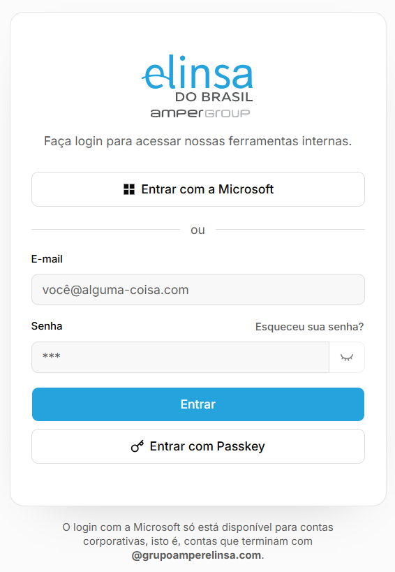
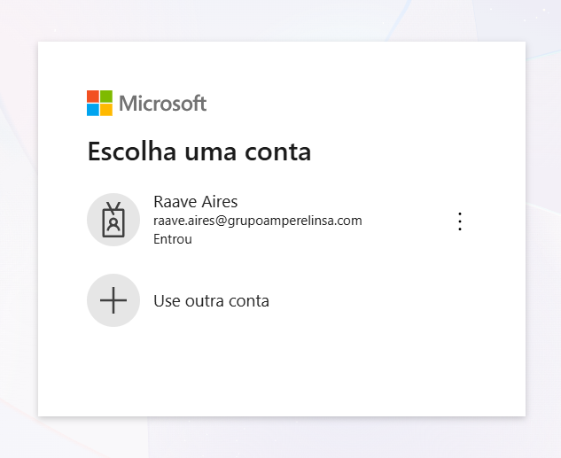
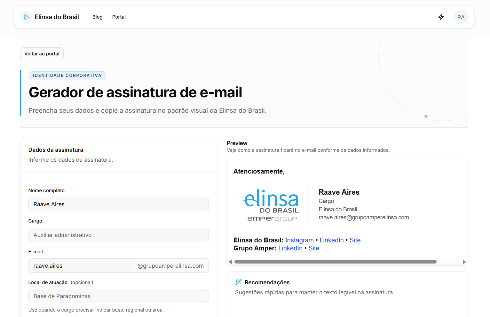
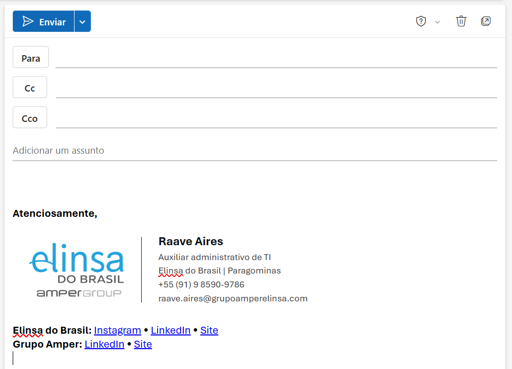

import { OutlookCompatibilityTable } from "@/components/outlook-compatibility-table";

O gerador da Elinsa cria sua assinatura no padrão da empresa, com logotipo e links oficiais. Para usá-lo, entre com sua conta corporativa e confira seus dados. O vídeo mostra como concluir a configuração no Outlook.

Antes de começar, confirme qual versão do Outlook você usa:

<OutlookCompatibilityTable />

Este tutorial serve para o app Outlook e para o [Outlook na web](https://outlook.cloud.microsoft). No **Outlook (classic)**, as telas e os passos são diferentes, então este tutorial não se aplica a ele.

Se você usa o Outlook (classic), faça a configuração pelo app Outlook ou pela versão web. Depois, a assinatura também aparecerá na versão clássica.

<Callout type="warning" title="Limitação do Outlook no celular">
  Por uma limitação dos aplicativos do Outlook para Android e iOS, a assinatura
  configurada no computador ou na versão web não é aplicada no celular. Por
  isso, ela não aparecerá nos e-mails enviados por esses aplicativos.
</Callout>

## Como criar sua assinatura

### 1. Entre no portal

Abra o <a href="https://elinsadobrasil.com.br/portal/mercurio" target="_blank" rel="noreferrer">gerador de assinatura de e-mail</a>. Se a tela de login aparecer, clique em **Entrar com a Microsoft**.

<Callout type="info" title="Já abriu direto no gerador?">
  Então você já está conectado. Vá para o
  [passo 2](#2-confira-suas-informações).
</Callout>

Na tela da Microsoft, escolha sua conta corporativa da Elinsa.

### 2. Confira suas informações

Confira se seu nome, cargo, telefone e os demais dados estão corretos. Essas informações serão usadas na assinatura.

### 3. Acompanhe o vídeo

Use o vídeo abaixo para preencher o que falta, copiar a assinatura e configurá-la no Outlook.

<YouTubeEmbed
  videoId="cPnVJZ6l1TQ"
  title="Passo a passo: nova assinatura da Elinsa no Outlook"
/>

## Teste no Outlook

Depois de configurar a assinatura, abra uma nova mensagem no Outlook e confirme se ela aparece corretamente.

Se algum dado precisar de correção, ajuste-o no gerador e copie a assinatura novamente. Se ela não aparecer automaticamente, volte ao vídeo e confira como defini-la como padrão no Outlook.

