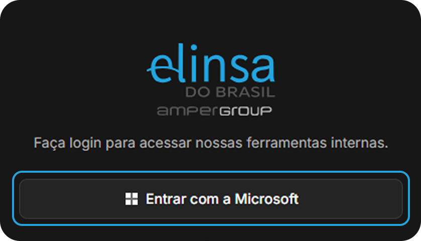
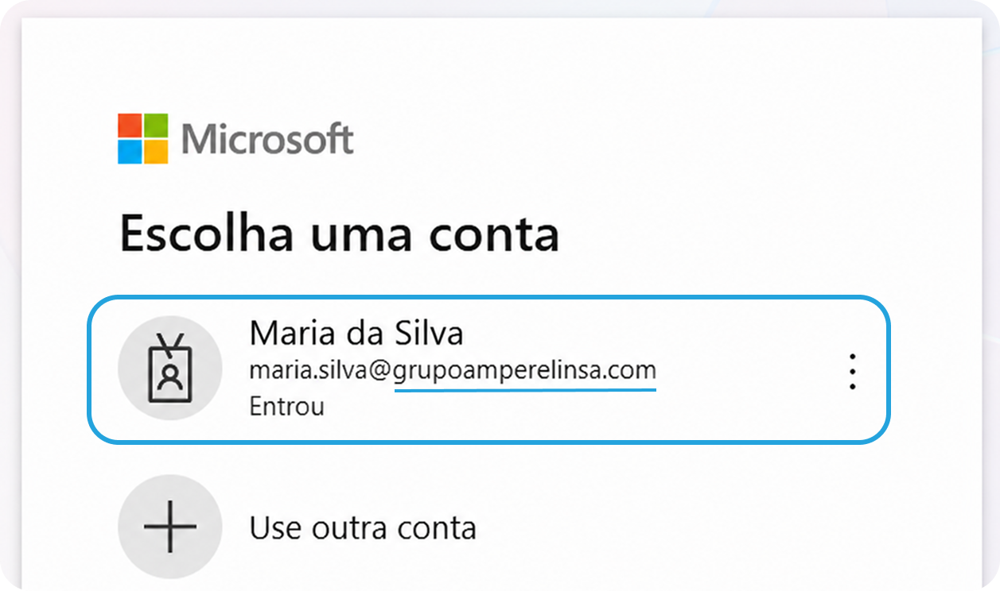
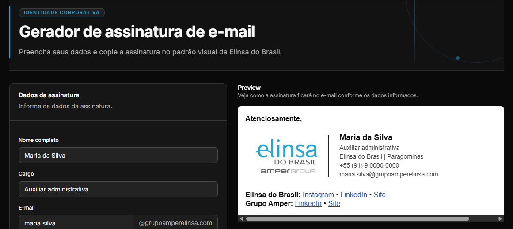
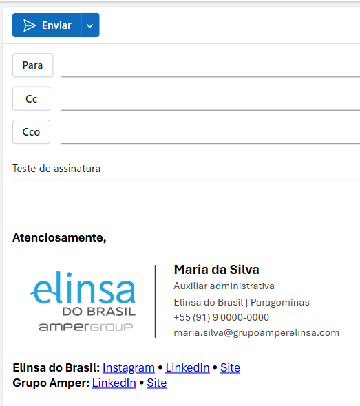

import { OutlookCompatibilityTable } from "@/components/outlook-compatibility-table";
import Capa from "./capa-do-video-tutorial.webp";

Antes de começar, confirme qual versão do Outlook você usa:

<OutlookCompatibilityTable />

Este guia deve ser seguido no novo Outlook ou no [Outlook na web](https://outlook.cloud.microsoft). Se você usa o Outlook clássico, faça a configuração em uma dessas versões; depois, a assinatura deverá aparecer também na versão clássica.

<Callout type="warning" title="A assinatura não aparecerá no celular">
  Por uma limitação do Outlook para Android e iPhone, a assinatura configurada
  no computador ou na web não será usada nos e-mails enviados pelo celular.
</Callout>

## Como criar sua assinatura

### 1. Entre no portal

Abra o <a href="https://elinsadobrasil.com.br/portal/mercurio" target="_blank" rel="noreferrer">gerador de assinatura de e-mail</a>. Se a tela de login aparecer, clique em **Entrar com a Microsoft** e escolha sua conta corporativa da Elinsa.

<Callout type="info" title="Já abriu direto no gerador?">
  Então você já está conectado. Vá para o
  [passo 2](#2-confira-suas-informações).
</Callout>

<Callout type="info" title="E-mail corporativo">
  A conta corporativa da Elinsa é a que termina com
  **@grupoamperelinsa.com**. Se você não tiver uma conta com esse domínio, este
  tutorial não se aplica a você.
</Callout>

### 2. Confira suas informações

Confira seu nome, cargo, telefone, local de atuação e os demais dados. Corrija ou preencha o que estiver faltando, pois essas informações serão exibidas na assinatura.

#### Dicas para manter o padrão

Antes de continuar, siga estas orientações para manter o padrão da assinatura:

- **Escreva o nome com as iniciais maiúsculas:** não use todas as letras em maiúsculas ou minúsculas. Mantenha `de`, `da`, `do`, `das` e `dos` em minúsculas:
  - `MARIA DA SILVA` ou `maria da silva` → `Maria da Silva`
  - `JOÃO PEDRO DOS SANTOS` ou `joão pedro dos santos` → `João Pedro dos Santos`
  - `ANA PAULA DE SOUZA` ou `ana paula de souza` → `Ana Paula de Souza`
- **Abrevie os nomes do meio:** mantenha o primeiro nome e o último sobrenome por extenso. Nos nomes intermediários, use apenas a inicial:
  - `Maria Aparecida de Souza` → `Maria A. de Souza`
  - `João Pedro Henrique da Silva` → `João P. H. da Silva`
  - `Ana Carolina dos Santos` → `Ana C. dos Santos`
  - `Carlos Eduardo Lima` → `Carlos E. Lima`
- **Revise a grafia:** confira letras, espaços e acentos antes de copiar a assinatura.
- **Confira os demais dados:** verifique se cargo, telefone e local de atuação estão atualizados.

### 3. Acompanhe o vídeo

Assista ao vídeo para completar os dados, copiar a assinatura e defini-la como padrão no Outlook.

<VideoEmbed
  src="https://video.elinsadobrasil.com.br/passo-a-passo-assinatura-de-email.mp4"
  title="Passo a passo: nova assinatura da Elinsa no Outlook"
  description="Veja como preencher os dados, copiar a assinatura e defini-la como padrão no Outlook."
  poster={Capa}
/>

### 4. Teste no Outlook

Escreva um novo e-mail no Outlook e confirme se a assinatura aparece corretamente.

Se algum dado estiver incorreto, ajuste-o no gerador e copie a assinatura novamente. Se ela não aparecer, reveja no vídeo a etapa em que a assinatura é definida como padrão.

